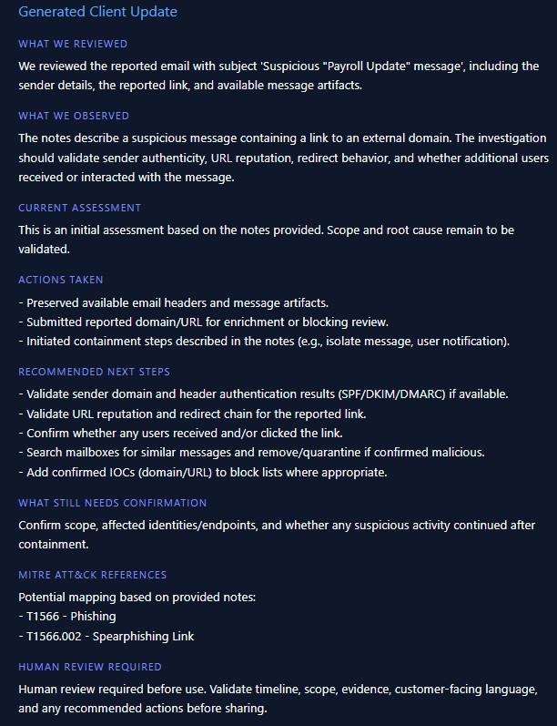

# AI Incident Report / Client Update Generator

Lightweight Streamlit scaffold that converts safe, fictional SOC analyst notes into structured incident response deliverables for portfolio demos.

## Demo Screenshot



This screenshot shows a safe demo phishing investigation being converted into a client-ready update with recommended next steps, potential MITRE ATT&CK references based on the provided notes, and required human review guidance. The screenshot uses safe demo data only.

## Features

- Streamlit interface with analyst note entry, demo-case loaders, and report-type selection.
- Mock report generator that always outputs the required incident sections (summary, findings, evidence, impact, actions, next steps, and human review reminder).
- Safe demo samples for phishing, suspicious login/impossible travel, and malware alert scenarios.
- Works fully offline in mock mode by default.
- Optional live OpenAI generation when `OPENAI_API_KEY` is set (environment variable only).

## Getting Started

1. (Optional) Create a virtual environment: `python -m venv .venv`
2. Install dependencies: `pip install -r src/requirements.txt`
3. Run the Streamlit app: `streamlit run src/app.py`

## Demo Data

All demo payloads live in `sample-data/`:

- `phishing-investigation.txt`
- `suspicious-login.txt`
- `malware-alert.txt`

They are purely fabricated, hard-coded, and read-only for the demo buttons inside the UI.

## Security Notes

- Use only the provided sample data; the UI explicitly warns against pasting real client or employer data.
- No `.env` file is committed; the repo only provides `.env.example` as a placeholder for future API keys.
- Analyst notes are never persisted beyond the Streamlit session.
- If `OPENAI_API_KEY` is set, clicking **Generate Report** will send the provided notes to OpenAI for processing. Use safe demo data only.

## Optional OpenAI Mode

- This project runs in **mock mode** by default and works without an OpenAI API key.
- To enable **live OpenAI mode**, set `OPENAI_API_KEY` as an environment variable (never commit API keys to git).
- `OPENAI_MODEL` is optional; if unset, it defaults to `gpt-4o-mini`.
- Live OpenAI mode sends the provided analyst notes to OpenAI for processing. Use safe demo data only.
- Do not paste real client data, employer data, production alerts, secrets, tokens, credentials, or confidential information.

PowerShell (Windows) example:

```powershell
$env:OPENAI_API_KEY="your_openai_api_key_here"
$env:OPENAI_MODEL="gpt-4o-mini"
python -m streamlit run src/app.py
```

Notes:

- If you omit `OPENAI_MODEL`, the app will use `gpt-4o-mini`.
- The app does not store analyst notes, does not write local report files, and does not log note contents.
- If you want to use live mode, install the OpenAI SDK separately: `pip install openai`

## File Layout

```
.
├── sample-data/             # Safe demo note templates
├── screenshots/             # Placeholder for future interface captures (.gitkeep)
├── src/
│   ├── app.py               # Streamlit UI
│   ├── report_generator.py  # Mock structured report builder
│   ├── prompts.py           # Output-type prompts and templates
│   └── requirements.txt     # Dependencies
├── .env.example             # Placeholder for sensitive keys
└── README.md
```
